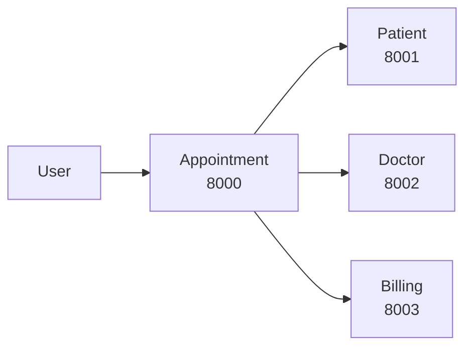
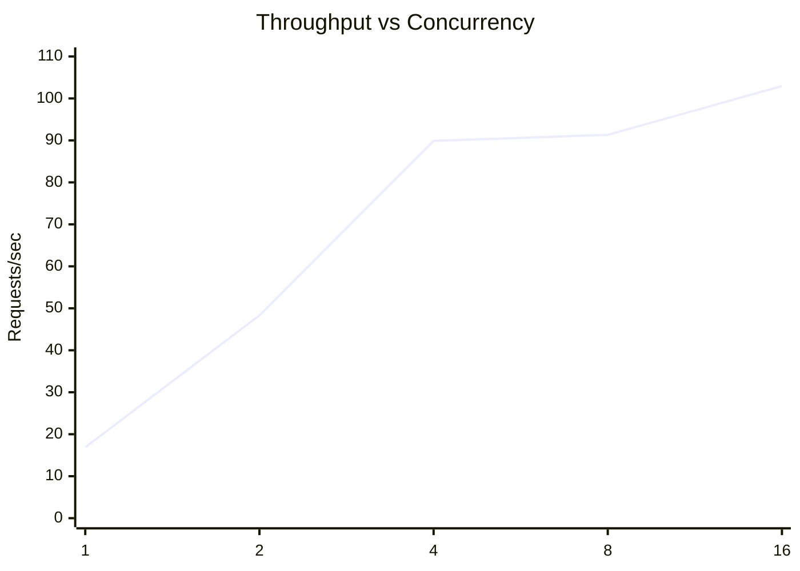

# 🏥 Hospital Management System — Microservices

A containerized **Hospital Management System** built using **FastAPI, Docker, and Microservices Architecture**. The system consists of independent services for appointments, patients, doctors, and billing.

## 📑 Contents

* [Architecture](#-architecture)
* [Services](#-services)
* [Tech Stack](#-tech-stack)
* [Project Structure](#-project-structure)
* [APIs](#-apis)
* [Performance](#-performance)
* [Resource Usage](#-resource-usage)
* [Setup](#-setup)
* [Conclusion](#-conclusion)

---

## 🏗️ Architecture



The **Appointment Service** acts as the main service and communicates with the other microservices through REST APIs.

---

## 🔹 Services

| Service     | Port | Purpose                      |
| ----------- | ---: | ---------------------------- |
| Appointment | 8000 | Main service / orchestration |
| Patient     | 8001 | Patient management           |
| Doctor      | 8002 | Doctor management            |
| Billing     | 8003 | Billing management           |

---

## 🛠️ Tech Stack

| Component        | Technology          |
| ---------------- | ------------------- |
| Language         | Python              |
| Framework        | FastAPI             |
| API              | REST                |
| Containerization | Docker              |
| Orchestration    | Docker Compose      |
| Documentation    | Swagger / OpenAPI   |
| Testing          | Python Load Testing |
| Version Control  | Git / GitHub        |

---

## 📁 Project Structure

```text
hospital_microservices_4/
├── appointment-service/
├── patient-service/
├── doctor-service/
├── billing-service/
├── docker-compose.yml
├── load_test.py
└── README.md
```

---

## 🌐 APIs

| Service     | URL     | Swagger |
| ----------- | ------- | ------- |
| Appointment | `:8000` | `/docs` |
| Patient     | `:8001` | `/docs` |
| Doctor      | `:8002` | `/docs` |
| Billing     | `:8003` | `/docs` |

Example:

```text
http://localhost:8001/patients
http://localhost:8001/patients/1
http://localhost:8001/health
```

---

# 📊 Performance

The system was tested with **1, 2, 4, 8, and 16 concurrent requests**.

| Concurrent | Latency (ms) | Throughput (req/s) | Failures |
| ---------: | -----------: | -----------------: | -------: |
|          1 |        59.13 |              16.88 |        0 |
|          2 |        40.65 |              48.32 |        0 |
|          4 |        42.99 |              89.89 |        0 |
|          8 |        85.53 |              91.33 |        0 |
|         16 |       148.72 |             102.94 |        0 |

### Latency

```mermaid
xychart-beta
    title "Latency vs Concurrency"
    x-axis [1, 2, 4, 8, 16]
    y-axis "ms" 0 --> 160
    line [59.13, 40.65, 42.99, 85.53, 148.72]
```

### Throughput



**Result:** Maximum throughput = **102.94 req/s** with **0 failures**.

---

## 💻 Resource Usage

| Service     |   CPU |    Memory |
| ----------- | ----: | --------: |
| Appointment | 0.18% | 51.55 MiB |
| Doctor      | 0.17% | 33.56 MiB |
| Patient     | 0.17% | 33.11 MiB |

---

## 🐳 Setup

```bash
git clone <YOUR_REPOSITORY_URL>
cd hospital_microservices_4
docker compose up --build
```

Stop services:

```bash
docker compose down
```

Check containers:

```bash
docker ps
```

Swagger:

```text
http://localhost:8000/docs
http://localhost:8001/docs
http://localhost:8002/docs
http://localhost:8003/docs
```

---

## ✅ Key Features

* Microservices-based architecture
* Independent Docker containers
* REST API communication
* FastAPI backend
* Swagger documentation
* Concurrent load testing
* Performance and resource analysis

---

## 🏁 Conclusion

The project demonstrates a **Dockerized Hospital Management System using Microservices Architecture**. The services operate independently and communicate through REST APIs. Performance testing achieved **102.94 requests/second with zero failures**, demonstrating reliable operation under the tested load.

## 👨‍💻 Team

| Member    | Contribution              |
| --------- | ------------------------- |
| Chaitanya | Development & Integration |
| Divya     | Billing Service           |
| Team      | Testing & Integration     |

---
