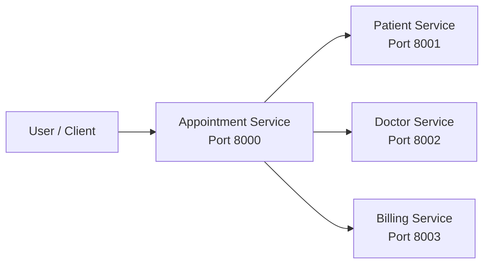
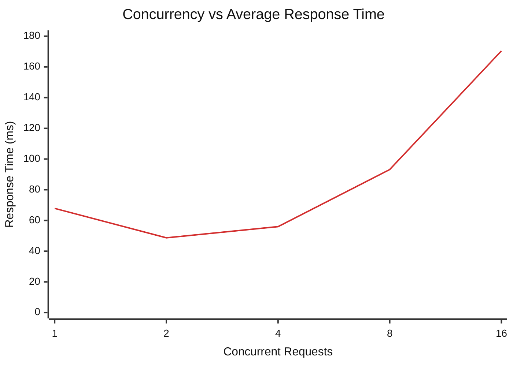
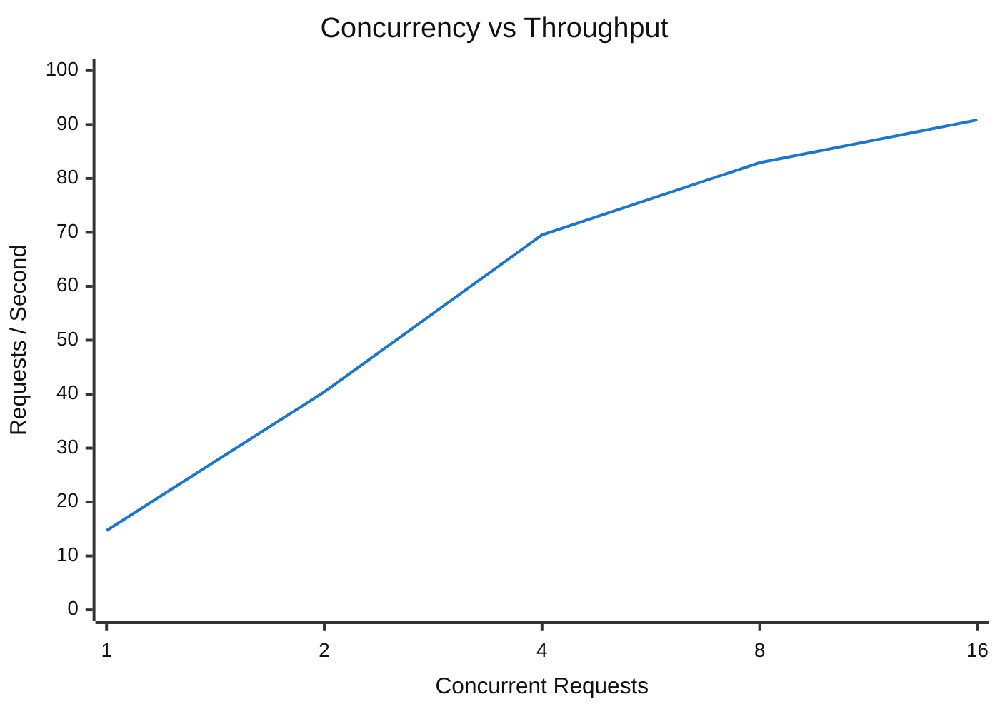
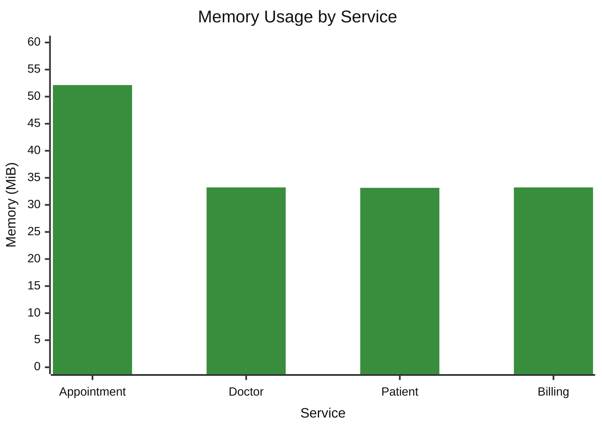

# 🏥 Hospital Management Microservices

A containerized **Hospital Management System** built using **FastAPI, Docker, REST APIs, Docker Compose, and SQLite**. The system follows a microservices architecture in which hospital operations are divided into independent services for **appointments, patients, doctors, and billing**.

Each service runs in its own Docker container, maintains its own database, exposes REST APIs, and communicates with other services through the Docker network.

---

## 📑 Contents

1. [Project Overview](#-project-overview)
2. [Objectives](#-objectives)
3. [Architecture](#-architecture)
4. [Microservices](#-microservices)
5. [Service Details](#-service-details)
6. [Inter-Service Communication](#-inter-service-communication)
7. [Database Isolation](#-database-isolation)
8. [Technology Stack](#-technology-stack)
9. [Project Structure](#-project-structure)
10. [Docker Containerization](#-docker-containerization)
11. [Execution](#-execution)
12. [APIs and Swagger](#-apis-and-swagger)
13. [Performance Testing](#-performance-testing)
14. [Performance Results](#-performance-results)
15. [Performance Graphs](#-performance-graphs)
16. [Resource Usage](#-resource-usage)
17. [Analysis](#-analysis)
18. [Docker Network](#-docker-network)
19. [Key Features](#-key-features)
20. [Evaluation Checklist](#-evaluation-checklist)
21. [Conclusion](#-conclusion)

---

# 🏥 Project Overview

The project implements a **Hospital Management System using Microservices Architecture**.

Instead of implementing the complete application as a single monolithic application, the system separates hospital operations into independent services:

* 📅 Appointment Service
* 👤 Patient Service
* 👨‍⚕️ Doctor Service
* 💳 Billing Service

Each service:

* Runs independently
* Has a dedicated responsibility
* Runs inside its own Docker container
* Maintains its own SQLite database
* Exposes REST APIs
* Can be accessed through Swagger/OpenAPI documentation
* Communicates with other services through the Docker network

### Overall Flow

```text
Client
  │
  ▼
Appointment Service
  │
  ├──────────► Patient Service
  │
  ├──────────► Doctor Service
  │
  └──────────► Billing Service
```

---

# 🎯 Objectives

The main objectives of the project are:

1. Implement a hospital management application using microservices.
2. Separate hospital functionality into independent services.
3. Develop REST APIs using FastAPI.
4. Store service-specific data using SQLite.
5. Containerize each service using Docker.
6. Deploy all services using Docker Compose.
7. Establish communication between services through a Docker network.
8. Generate different workload levels.
9. Measure response time and throughput.
10. Monitor CPU and memory utilization.
11. Analyze system performance under increasing concurrency.

---

# 🏗️ Architecture

The system follows a **service-oriented microservices architecture**.



### Architecture Explanation

The **Appointment Service** acts as the main entry point for the application.

When an operation requires information from another service, the Appointment Service communicates with the appropriate service using REST APIs over the Docker Compose network.

This provides:

* Service independence
* Loose coupling
* Separation of responsibilities
* Independent databases
* Independent container execution
* Easier maintenance and testing

---

# 📦 Microservices

| Service        |   Port | Database          | Main Responsibility                        |
| :------------- | -----: | :---------------- | :----------------------------------------- |
| 📅 Appointment | `8000` | `appointments.db` | Appointment management and orchestration   |
| 👤 Patient     | `8001` | `patients.db`     | Patient information management             |
| 👨‍⚕️ Doctor   | `8002` | `doctors.db`      | Doctor information management              |
| 💳 Billing     | `8003` | `billing.db`      | Billing and payment information management |

---

# 🔧 Service Details

## 1. 📅 Appointment Service

**Port:** `8000`
**Database:** `appointments.db`

The Appointment Service manages hospital appointments and acts as the primary service for coordinating appointment-related operations.

### Responsibilities

* Create appointments
* Retrieve appointment information
* Manage appointment records
* Validate appointment-related information
* Coordinate with the Patient Service
* Coordinate with the Doctor Service
* Coordinate with the Billing Service when required

### Role in the Architecture

```text
                 Appointment Service
                        :8000
                   /      |      \
                  /       |       \
                 ▼        ▼        ▼
             Patient    Doctor   Billing
```

The Appointment Service therefore functions as the main orchestration layer for operations involving multiple hospital services.

---

## 2. 👤 Patient Service

**Port:** `8001`
**Database:** `patients.db`

The Patient Service manages patient-related information.

### Responsibilities

* Register patients
* Store patient records
* Retrieve patient information
* Update patient information
* Delete patient records
* Provide patient information to other services through REST APIs

### Data Managed

```text
Patient ID
Name
Contact Information
Patient Details
```

The Patient Service maintains its own database and does not directly access the databases of other services.

---

## 3. 👨‍⚕️ Doctor Service

**Port:** `8002`
**Database:** `doctors.db`

The Doctor Service manages doctor-related information.

### Responsibilities

* Register doctors
* Store doctor records
* Retrieve doctor information
* Update doctor information
* Delete doctor records
* Provide doctor information for appointment-related operations

### Data Managed

```text
Doctor ID
Doctor Name
Specialization
Availability / Details
```

The service operates independently and communicates with other services through REST APIs.

---

## 4. 💳 Billing Service

**Port:** `8003`
**Database:** `billing.db`

The Billing Service manages billing-related information.

### Responsibilities

* Create billing records
* Store billing information
* Retrieve billing records
* Update billing information
* Provide billing information when required by appointment workflows

### Data Managed

```text
Bill ID
Patient / Appointment Reference
Charges
Billing Details
```

The Billing Service is independently containerized and maintains its own SQLite database.

---

# 🔄 Inter-Service Communication

Communication between services takes place through **REST APIs over the Docker Compose network**.

The services do not communicate by directly accessing each other's databases.

### Communication Flow

```text
                     Client
                       │
                       ▼
              ┌─────────────────┐
              │   Appointment   │
              │    :8000        │
              └────────┬────────┘
                       │
          ┌────────────┼────────────┐
          │            │            │
          ▼            ▼            ▼
   ┌────────────┐ ┌──────────┐ ┌──────────┐
   │  Patient   │ │  Doctor  │ │ Billing  │
   │   :8001    │ │  :8002   │ │  :8003   │
   └────────────┘ └──────────┘ └──────────┘
```

### Communication Sequence

1. Client sends a request to the Appointment Service.
2. Appointment Service processes the request.
3. If patient information is required, it communicates with Patient Service.
4. If doctor information is required, it communicates with Doctor Service.
5. If billing information is required, it communicates with Billing Service.
6. The required information is processed.
7. The final response is returned to the client.

### Benefits

* Loose coupling
* Independent service development
* Service isolation
* Better maintainability
* Easier testing
* Independent deployment

---

# 🗄️ Database Isolation

Each microservice uses a separate SQLite database.

| Service     | Database          | Purpose             |
| :---------- | :---------------- | :------------------ |
| Appointment | `appointments.db` | Appointment records |
| Patient     | `patients.db`     | Patient records     |
| Doctor      | `doctors.db`      | Doctor records      |
| Billing     | `billing.db`      | Billing records     |

### Database Architecture

```text
Appointment Service ──► appointments.db

Patient Service     ──► patients.db

Doctor Service      ──► doctors.db

Billing Service     ──► billing.db
```

### Why Separate Databases?

Database separation ensures that:

* Each service owns its data.
* Services remain independent.
* One service does not directly modify another service's database.
* Services communicate through APIs rather than database access.
* Individual services can be maintained independently.

---

# 🛠️ Technology Stack

| Component            | Technology        |
| :------------------- | :---------------- |
| Programming Language | Python            |
| Backend Framework    | FastAPI           |
| API Architecture     | REST              |
| Database             | SQLite            |
| Containerization     | Docker            |
| Orchestration        | Docker Compose    |
| API Documentation    | Swagger / OpenAPI |
| Load Testing         | Python / HTTPX    |
| Monitoring           | Docker Stats      |
| Version Control      | Git / GitHub      |

---

# 📁 Project Structure

```text
hospital_microservices_4/
│
├── appointment-service/
│   ├── Dockerfile
│   ├── requirements.txt
│   └── application files
│
├── patient-service/
│   ├── Dockerfile
│   ├── requirements.txt
│   └── application files
│
├── doctor-service/
│   ├── Dockerfile
│   ├── requirements.txt
│   └── application files
│
├── billing-service/
│   ├── Dockerfile
│   ├── requirements.txt
│   └── application files
│
├── docker-compose.yml
├── load_test.py
├── README.md
└── .gitignore
```

---

# 🐳 Docker Containerization

Each service is packaged as an independent Docker container.

```text
                     Docker Compose
                           │
          ┌────────────────┼────────────────┐
          │                │                │
          ▼                ▼                ▼
   Appointment          Patient          Doctor
    Container          Container        Container
      :8000              :8001            :8002
          │                │                │
          └────────────────┼────────────────┘
                           │
                           ▼
                      Billing
                     Container
                       :8003
```

### Docker Advantages

* Isolated runtime environments
* Independent service execution
* Reproducible deployment
* Easy service management
* Consistent environments
* Simple network configuration
* Easier testing and monitoring

---

# 🚀 Execution

## 1. Build and Start

```bash
docker compose up --build -d
```

This builds the Docker images and starts all services in detached mode.

---

## 2. Check Running Containers

```bash
docker compose ps
```

The four services should be running on their configured ports.

---

## 3. View Logs

```bash
docker compose logs
```

To view the logs of a specific service:

```bash
docker compose logs appointment-service
```

---

## 4. Monitor Resources

```bash
docker stats
```

This command provides:

* CPU utilization
* Memory usage
* Memory percentage
* Network information
* Container activity

---

## 5. Stop the Application

```bash
docker compose down
```

---

# 🌐 APIs and Swagger

Each FastAPI service provides interactive API documentation through Swagger/OpenAPI.

| Service     | Base URL                | Swagger |
| :---------- | :---------------------- | :------ |
| Appointment | `http://localhost:8000` | `/docs` |
| Patient     | `http://localhost:8001` | `/docs` |
| Doctor      | `http://localhost:8002` | `/docs` |
| Billing     | `http://localhost:8003` | `/docs` |

### Swagger URLs

```text
http://localhost:8000/docs
http://localhost:8001/docs
http://localhost:8002/docs
http://localhost:8003/docs
```

Swagger allows the APIs to be:

* Viewed
* Tested
* Debugged
* Demonstrated during evaluation

---

# ⚡ Performance Testing

The application was tested under increasing concurrent workloads.

The selected workload levels were:

```text
1 → 2 → 4 → 8 → 16 concurrent requests
```

Five workload levels were used to observe how the system behaves as concurrency increases.

## Metrics Measured

The following performance metrics were recorded:

1. Average Response Time
2. Throughput
3. Failed Requests
4. CPU Utilization
5. Memory Utilization

---

# 📊 Performance Results

| Workload | Concurrent Requests | Avg Response Time (ms) | Throughput (req/s) | Failed Requests |
| :------: | ------------------: | ---------------------: | -----------------: | --------------: |
|    W1    |                   1 |              **67.87** |          **14.71** |           **0** |
|    W2    |                   2 |              **48.70** |          **40.42** |           **0** |
|    W3    |                   4 |              **55.97** |          **69.52** |           **0** |
|    W4    |                   8 |              **93.16** |          **82.93** |           **0** |
|    W5    |                  16 |             **170.43** |          **90.86** |           **0** |

---

# 📈 Performance Graphs

## 1. Concurrent Requests vs Average Response Time

The graph shows how average response time changes as concurrent workload increases.



### Observation

Response time initially decreases from **67.87 ms to 48.70 ms**, then increases as concurrency increases.

At 16 concurrent requests, the response time reaches **170.43 ms**, indicating increased processing and communication overhead under higher workload.

---

# 📈 2. Concurrent Requests vs Throughput

Throughput represents the number of requests processed per second.



### Observation

Throughput increases as concurrency increases:

```text
14.71 → 40.42 → 69.52 → 82.93 → 90.86 req/s
```

The highest measured throughput is **90.86 req/s at 16 concurrent requests**.

This indicates that the system can process a larger number of requests when more concurrent requests are available.

---

# 📊 3. Memory Usage by Service

The following graph compares the memory consumption of the four containers during resource monitoring.



---

# 💻 Resource Usage

Docker resource monitoring was performed using `docker stats`.

| Service     | CPU Usage |  Memory Usage |  Memory % |
| :---------- | --------: | ------------: | --------: |
| Appointment | **0.26%** | **52.14 MiB** | **0.67%** |
| Doctor      | **0.21%** | **33.23 MiB** | **0.43%** |
| Patient     | **0.22%** | **33.15 MiB** | **0.43%** |
| Billing     | **0.23%** | **33.23 MiB** | **0.43%** |

---

# 📊 Resource Analysis

### CPU Utilization

| Service     | CPU Usage |
| :---------- | --------: |
| Appointment |     0.26% |
| Doctor      |     0.21% |
| Patient     |     0.22% |
| Billing     |     0.23% |

All services recorded low CPU utilization during the monitoring snapshot.

### Memory Utilization

| Service     |        Memory |
| :---------- | ------------: |
| Appointment | **52.14 MiB** |
| Doctor      | **33.23 MiB** |
| Patient     | **33.15 MiB** |
| Billing     | **33.23 MiB** |

The **Appointment Service consumed the highest memory**, while the **Patient Service recorded the lowest memory usage**.

---

# 🔍 Performance Analysis

## Response Time

The lowest measured response time was:

**48.70 ms at 2 concurrent requests**

At 16 concurrent requests, response time increased to:

**170.43 ms**

This indicates that response latency becomes higher as the workload increases.

---

## Throughput

The highest measured throughput was:

**90.86 req/s at 16 concurrent requests**

Throughput increased significantly as concurrency increased from 1 to 16.

| Concurrency |      Throughput |
| ----------: | --------------: |
|           1 |     14.71 req/s |
|           2 |     40.42 req/s |
|           4 |     69.52 req/s |
|           8 |     82.93 req/s |
|          16 | **90.86 req/s** |

---

## Reliability

All tested workload levels recorded:

**0 failed requests**

Therefore:

```text
Failure Rate = 0%
```

The application successfully processed all measured workload levels without recorded request failures.

---

## Resource Consumption

The Appointment Service consumed the most memory:

**52.14 MiB**

The remaining services consumed approximately:

**33 MiB each**

CPU usage remained below **0.30%** for all monitored services.

---

# 🐳 Docker Network

All services operate within the Docker Compose network.

```text
                     Docker Network
                           │
                           ▼
                ┌────────────────────┐
                │ Appointment :8000  │
                └─────────┬──────────┘
                          │
             ┌────────────┼────────────┐
             │            │            │
             ▼            ▼            ▼
       Patient :8001  Doctor :8002  Billing :8003
```

### Network Communication

Services communicate using Docker service names rather than relying on external network configuration.

This allows the containers to communicate within the application network while remaining independently deployable.

---

# 🔄 End-to-End Request Flow

A typical multi-service operation follows this pattern:

```text
        User
         │
         ▼
 Appointment Request
         │
         ▼
 Appointment Service
         │
    ┌────┼─────┐
    │    │     │
    ▼    ▼     ▼
 Patient Doctor Billing
 Service Service Service
    │    │     │
    └────┼─────┘
         │
         ▼
   Processed Result
         │
         ▼
        User
```

This demonstrates how multiple independent services cooperate to complete an application-level operation.

---

# 🧪 Testing and Monitoring Workflow

The complete experiment follows this workflow:

```text
DEVELOP
   ↓
CONTAINERIZE
   ↓
DEPLOY
   ↓
CONNECT
   ↓
LOAD TEST
   ↓
MONITOR
   ↓
ANALYZE
   ↓
DEMONSTRATE
```

---

# 📋 Performance Observation Table

The complete measured performance observation is summarized below.

| Workload | Concurrency | Avg Response Time |  Throughput | Failures |
| :------: | ----------: | ----------------: | ----------: | -------: |
|    W1    |           1 |          67.87 ms | 14.71 req/s |        0 |
|    W2    |           2 |          48.70 ms | 40.42 req/s |        0 |
|    W3    |           4 |          55.97 ms | 69.52 req/s |        0 |
|    W4    |           8 |          93.16 ms | 82.93 req/s |        0 |
|    W5    |          16 |         170.43 ms | 90.86 req/s |        0 |

---

# 📌 Key Findings

| Metric                     | Result          |
| :------------------------- | :-------------- |
| Highest Throughput         | **90.86 req/s** |
| Lowest Response Time       | **48.70 ms**    |
| Highest Response Time      | **170.43 ms**   |
| Maximum Tested Concurrency | **16**          |
| Failed Requests            | **0**           |
| Highest Memory Usage       | **52.14 MiB**   |
| Highest CPU Usage          | **0.26%**       |
| Lowest Memory Usage        | **33.15 MiB**   |

---

# 📦 Deployment Components

The project contains the following major deployment components:

| Component            | Purpose                                             |
| :------------------- | :-------------------------------------------------- |
| Dockerfile           | Builds the image for each service                   |
| `docker-compose.yml` | Defines and manages all containers                  |
| FastAPI Application  | Provides REST APIs                                  |
| SQLite Database      | Stores service-specific data                        |
| Docker Network       | Enables service-to-service communication            |
| `load_test.py`       | Generates workload and collects performance results |
| Docker Stats         | Monitors container resources                        |

---

# 🧩 Advantages of the Microservices Approach

### 1. Independent Services

Each hospital operation is separated into an independent service.

### 2. Loose Coupling

Services communicate through APIs rather than directly accessing each other's databases.

### 3. Independent Deployment

Individual services can be rebuilt and deployed independently.

### 4. Fault Isolation

A problem in one service can be isolated from the implementation of other services.

### 5. Maintainability

Smaller services are easier to understand, modify, test, and maintain.

### 6. Scalability

Individual services can be scaled according to their workload requirements.

---

# ⚠️ Performance Trade-Off

The performance results show an important relationship between concurrency, throughput, and response time.

At low concurrency:

```text
Lower workload
      ↓
Lower response time
```

As concurrency increases:

```text
Higher concurrency
      ↓
More simultaneous processing
      ↓
Higher throughput
      ↓
Increased response time
```

In this experiment, throughput continued increasing up to **90.86 req/s**, while response time increased considerably at the highest workload.

---

---

# 📊 Final Performance Summary

```text
Workload        Response Time       Throughput

1 concurrent       67.87 ms          14.71 req/s
      │
      ▼
2 concurrent       48.70 ms          40.42 req/s
      │
      ▼
4 concurrent       55.97 ms          69.52 req/s
      │
      ▼
8 concurrent       93.16 ms          82.93 req/s
      │
      ▼
16 concurrent     170.43 ms          90.86 req/s
```

The system demonstrates increasing throughput with increasing concurrency, while response time becomes higher at heavier workloads.

---

# 🏁 Conclusion

The project successfully demonstrates a **Dockerized Hospital Management System using Microservices Architecture**.

The application separates hospital operations into independent **Appointment, Patient, Doctor, and Billing services**. Each service has its own responsibility, REST APIs, Docker container, and SQLite database.

Docker Compose is used to deploy and manage the services, while the Docker network enables communication between the containers. Swagger/OpenAPI provides interactive API documentation and simplifies API testing.

The system was evaluated under **1, 2, 4, 8, and 16 concurrent requests**.

The measured results showed:

* **90.86 req/s** maximum throughput
* **48.70 ms** lowest average response time
* **170.43 ms** highest average response time
* **0 failed requests** across all tested workloads
* **52.14 MiB** highest observed memory usage
* CPU utilization remained below **0.30%**

Overall, the project demonstrates the practical implementation of:

**FastAPI + REST APIs + Microservices + SQLite + Docker + Docker Compose + Container Networking + Load Testing + Resource Monitoring**

```text
                 🏥 HOSPITAL MANAGEMENT SYSTEM

                         ┌───────────┐
                         │   Client  │
                         └─────┬─────┘
                               │
                               ▼
                    ┌──────────────────┐
                    │   Appointment    │
                    │      :8000       │
                    └───────┬──────────┘
                            │
              ┌─────────────┼─────────────┐
              ▼             ▼             ▼
        ┌──────────┐  ┌──────────┐  ┌──────────┐
        │ Patient  │  │  Doctor  │  │ Billing  │
        │  :8001   │  │  :8002   │  │  :8003   │
        └──────────┘  └──────────┘  └──────────┘
              │             │             │
              ▼             ▼             ▼
        patients.db   doctors.db    billing.db

                    Docker Compose Network
```

---

## 📌 Project Summary

| Category            | Implementation              |
| :------------------ | :-------------------------- |
| Architecture        | Microservices               |
| Services            | 4                           |
| Backend             | FastAPI                     |
| Communication       | REST APIs                   |
| Databases           | SQLite                      |
| Containers          | Docker                      |
| Deployment          | Docker Compose              |
| Testing             | Concurrent Workload Testing |
| Monitoring          | Docker Stats                |
| Maximum Concurrency | 16                          |
| Maximum Throughput  | 90.86 req/s                 |
| Request Failures    | 0                           |
| Version Control     | Git / GitHub                |
