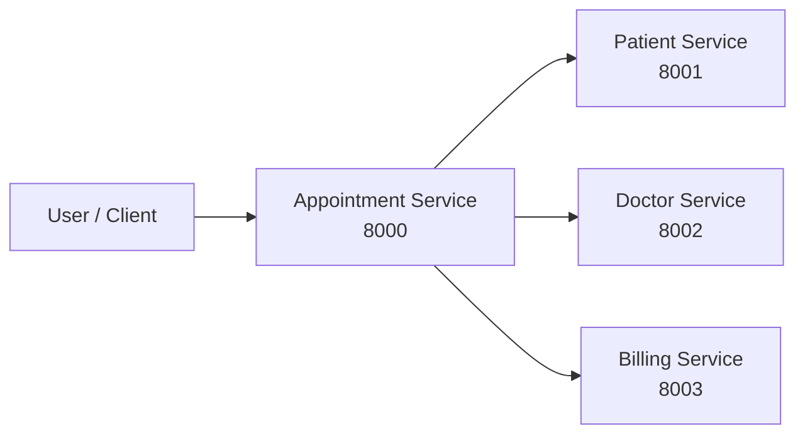
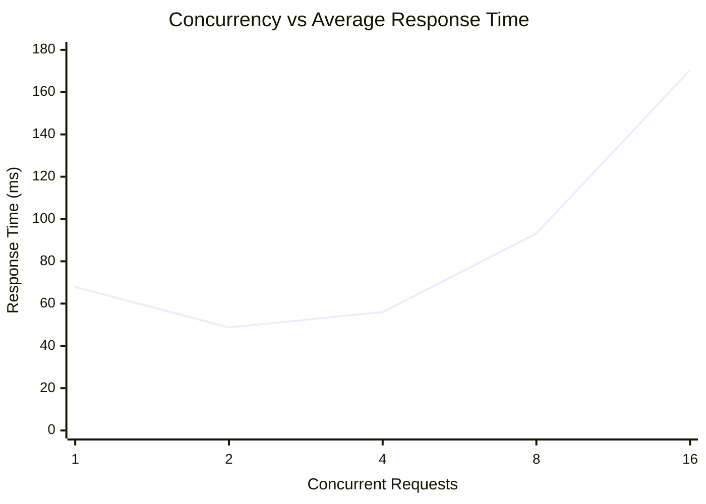
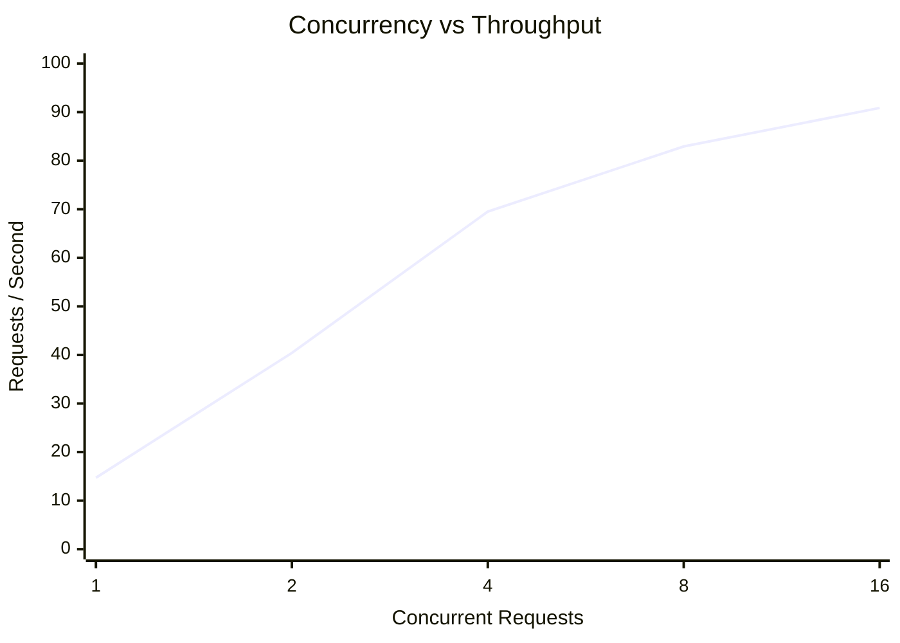
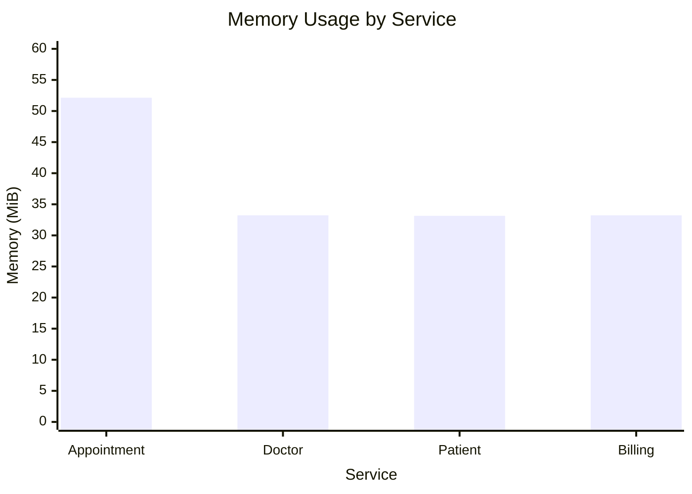

# 🏥 Hospital Management Microservices

A containerized **Hospital Management System** built using **FastAPI, Docker, REST APIs, and SQLite**. The system follows a microservices architecture with independent services for appointments, patients, doctors, and billing.

## 📑 Contents

1. [Project Overview](#-project-overview)
2. [Architecture](#-architecture)
3. [Microservices](#-microservices)
4. [Project Structure](#-project-structure)
5. [Execution](#-execution)
6. [APIs](#-apis)
7. [Performance Testing](#-performance-testing)
8. [Performance Results](#-performance-results)
9. [Resource Usage](#-resource-usage)
10. [Analysis](#-analysis)
11. [Conclusion](#-conclusion)

---

## 🏥 Project Overview

The project implements a **Hospital Management System using Microservices Architecture**.

The system separates major hospital operations into four independent services:

* Appointment Service
* Patient Service
* Doctor Service
* Billing Service

Each service runs independently in a Docker container and communicates through REST APIs.

### Key Features

* Independent microservices
* Docker containerization
* REST API communication
* SQLite database
* Swagger API documentation
* Concurrent load testing
* CPU and memory monitoring

---

## 🏗️ Architecture



The **Appointment Service** acts as the main service and communicates with the Patient, Doctor, and Billing services.

---

## 📦 Microservices

| Service     |   Port | Database        | Responsibility                         |
| ----------- | -----: | --------------- | -------------------------------------- |
| Appointment | `8000` | appointments.db | Appointment management & orchestration |
| Patient     | `8001` | patients.db     | Patient management                     |
| Doctor      | `8002` | doctors.db      | Doctor management                      |
| Billing     | `8003` | billing.db      | Billing management                     |

---

## 🛠️ Technology Stack

| Component        | Technology        |
| ---------------- | ----------------- |
| Language         | Python            |
| Framework        | FastAPI           |
| Database         | SQLite            |
| API              | REST              |
| Containerization | Docker            |
| Orchestration    | Docker Compose    |
| Load Testing     | Python / HTTPX    |
| Documentation    | Swagger / OpenAPI |
| Version Control  | Git / GitHub      |

---

## 📁 Project Structure

```text
hospital_microservices_4/
│
├── appointment-service/
├── patient-service/
├── doctor-service/
├── billing-service/
│
├── docker-compose.yml
├── load_test.py
├── README.md
└── .gitignore
```

---

## 🚀 Execution

### Build and Start

```bash
docker compose up --build -d
```

### Check Containers

```bash
docker compose ps
```

### Monitor Resources

```bash
docker stats
```

### Stop Services

```bash
docker compose down
```

---

## 🌐 APIs

| Service     | Base URL                | Swagger |
| ----------- | ----------------------- | ------- |
| Appointment | `http://localhost:8000` | `/docs` |
| Patient     | `http://localhost:8001` | `/docs` |
| Doctor      | `http://localhost:8002` | `/docs` |
| Billing     | `http://localhost:8003` | `/docs` |

Example:

```text
http://localhost:8000/docs
http://localhost:8001/docs
http://localhost:8002/docs
http://localhost:8003/docs
```

---

# ⚡ Performance Testing

The system was tested with increasing concurrent workloads:

**1 → 2 → 4 → 8 → 16 concurrent requests**

The following metrics were measured:

* Average Response Time
* Throughput
* Failed Requests

---

## 📊 Performance Results

| Concurrency | Avg Response Time (ms) | Throughput (req/s) | Failures |
| ----------: | ---------------------: | -----------------: | -------: |
|           1 |              **67.87** |          **14.71** |        0 |
|           2 |              **48.70** |          **40.42** |        0 |
|           4 |              **55.97** |          **69.52** |        0 |
|           8 |              **93.16** |          **82.93** |        0 |
|          16 |             **170.43** |          **90.86** |        0 |

---

## 📈 Response Time



---

## 📈 Throughput



---

# 💻 Resource Usage

Docker resource monitoring produced the following results:

| Service     | CPU Usage | Memory Usage | Memory % |
| ----------- | --------: | -----------: | -------: |
| Appointment |     0.26% |    52.14 MiB |    0.67% |
| Doctor      |     0.21% |    33.23 MiB |    0.43% |
| Patient     |     0.22% |    33.15 MiB |    0.43% |
| Billing     |     0.23% |    33.23 MiB |    0.43% |

---

## 📊 Memory Usage



---

# 🔍 Analysis

* **Highest throughput:** 90.86 req/s at 16 concurrent requests.
* **Lowest response time:** 48.70 ms at 2 concurrent requests.
* **Failed requests:** 0 across all tested workloads.
* Response time increased as concurrency increased beyond 4 users.
* The Appointment Service consumed the highest memory at **52.14 MiB**.
* All services maintained low CPU utilization during monitoring.

---

# 🐳 Docker Network

All services communicate through the Docker Compose network.

```text
                    Docker Network
                         │
          ┌──────────────┼──────────────┐
          ▼              ▼              ▼
     Patient          Doctor         Billing
      :8001           :8002           :8003
          ▲              ▲              ▲
          └──────────────┼──────────────┘
                         │
                  Appointment
                     :8000
```

---

# ✅ Key Features

| Feature                          | Status |
| -------------------------------- | ------ |
| Four Microservices               | ✅      |
| FastAPI REST APIs                | ✅      |
| Docker Containers                | ✅      |
| Docker Compose                   | ✅      |
| Service-to-Service Communication | ✅      |
| SQLite Persistence               | ✅      |
| Swagger Documentation            | ✅      |
| Load Testing                     | ✅      |
| Performance Analysis             | ✅      |
| Resource Monitoring              | ✅      |

---

#  Conclusion

The project successfully demonstrates a **Dockerized Hospital Management System using Microservices Architecture**.

The system handled workloads from **1 to 16 concurrent requests with zero failures**. Throughput increased from **14.71 req/s to 90.86 req/s**, while response time increased at higher concurrency.

The project demonstrates practical implementation of **FastAPI, REST APIs, Docker, Docker Compose, SQLite, microservices communication, load testing, and resource monitoring**.

---
